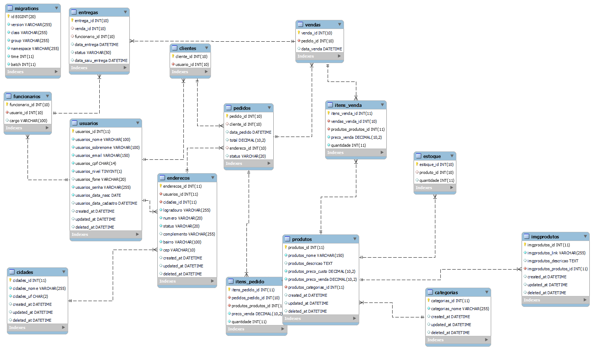
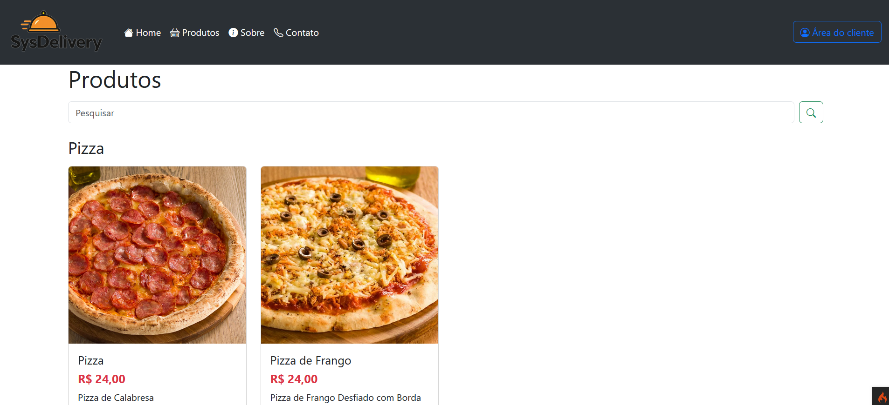
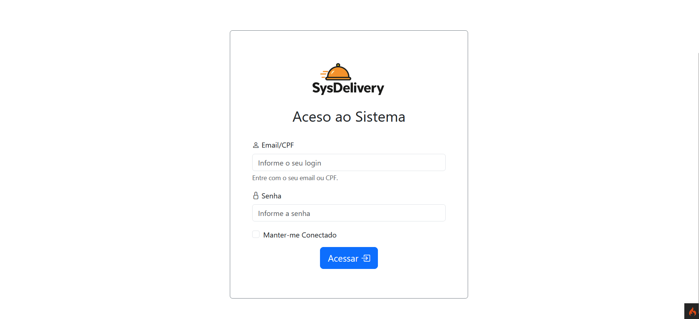
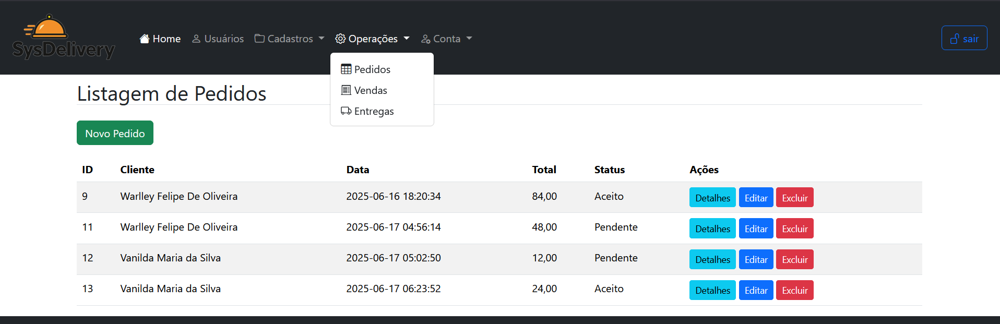

# 🛵 SysDelivery


**SysDelivery** é um sistema de gerenciamento de entregas (Delivery) desenvolvido como projeto acadêmico para o curso de Sistemas de Informação do IF Goiano. O objetivo é simular o fluxo de trabalho de uma aplicação real de delivery, incluindo cadastro de produtos, usuários, pedidos e entregas, utilizando arquitetura MVC e ambiente containerizado com Docker.

---

## 🎯 Objetivo

- Aplicar arquitetura MVC com CodeIgniter 4
- Gerenciar banco de dados MySQL com phpMyAdmin
- Criar ambiente LAMP utilizando Docker
- Desenvolver um sistema funcional para simulação de entregas
- Praticar versionamento de código com Git

---

## ✨ Funcionalidades

- Cadastro e gerenciamento de produtos
- Cadastro e gerenciamento de usuários (clientes, funcionários, entregadores)
- Criação e acompanhamento de pedidos
- Controle de entregas e status
- Interface web responsiva
- Autenticação de usuários
- Relatórios administrativos

---

## 🧰 Tecnologias Utilizadas

- **PHP 8.2**
- **Apache 2.4**
- **MySQL 8.0**
- **phpMyAdmin**
- **CodeIgniter 4**
- **Docker / Docker Compose**
- **Bootstrap 5** (frontend)
- **Git** (versionamento)


---

## 🏗️ Arquitetura do Projeto

O projeto segue a arquitetura MVC (Model-View-Controller) utilizando o framework CodeIgniter 4. O ambiente é orquestrado por Docker, garantindo portabilidade e facilidade de configuração.

```
Usuário ↔️ Interface Web ↔️ Controladores ↔️ Modelos ↔️ Banco de Dados
```

---

## 🗺️ DER - Diagrama Entidade Relacionamento
O Diagrama Entidade Relacionamento (DER) do projeto SysDelivery ilustra as principais entidades e seus relacionamentos, como Usuários, Produtos, Pedidos e Entregas. Ele serve como base para a modelagem do banco de dados.
 

---

## 📂 Estrutura de Pastas

```
webserver2/
├── Comandos docker.txt
├── docker-compose.yml
├── Dockerfile
├── estrutura.txt
├── README.md
└── www/
    ├── index.php
    └── codeigniter4/
        ├── .env
        ├── composer.json
        ├── LICENSE
        ├── phpunit.xml.dist
        ├── preload.php
        ├── projeto.sql
        ├── README.md
        ├── spark
        ├── app/
        ├── public/
        │   ├── assets/
        │   │   ├── css/
        │   │   │   └── style.css
        │   │   ├── images/
        │   │   │   ├── sd_logo.png
        │   │   │   ├── empresa.png
        │   │   │   ├── hamburguer1.png
        │   │   │   ├── pizza1.png
        │   │   │   └── ... (outras imagens)
        │   │   └── uploads/
        │   ├── favicon.ico
        │   ├── index.php
        │   └── robots.txt
        ├── system/
        ├── tests/
        └── writable/
```

---

## 📦 Pré-requisitos

- [Docker Desktop](https://www.docker.com/products/docker-desktop)
- [Git](https://git-scm.com/)
- [PHP](https://www.php.net/downloads) (opcional, para desenvolvimento local)
- [Composer](https://getcomposer.org/download/) (opcional, para desenvolvimento local)

---

## 🚀 Instruções de Instalação

1. **Clone o repositório:**
   ```bash
   git clone https://github.com/bielvitooor/sysdelivery.git
   cd sysdelivery
   ```

2. **Copie o arquivo de variáveis de ambiente (se necessário):**
   ```bash
   cp www/codeigniter4/.env.example www/codeigniter4/.env
   ```

3. **Inicie os containers Docker:**
   ```bash
   docker-compose up -d
   ```

4. **Acesse os serviços:**
   - Aplicação: [http://localhost:8050](http://localhost:8050)
   - phpMyAdmin: [http://localhost:8051](http://localhost:8051)
     - Login: root
     - Senha: root (ou a definida no .env)

---

## 💻 Como Utilizar

- Acesse a aplicação via navegador.
- Realize o cadastro de usuários, produtos e pedidos.
- Gerencie o fluxo de entregas pelo painel administrativo.
- Utilize o phpMyAdmin para visualizar e manipular o banco de dados, se necessário.

---

## 📸 Imagens do Sistema

Abaixo estão algumas imagens do sistema em funcionamento:




---

## 📝 Comandos Úteis

- **Reiniciar ambiente limpo:**
  ```bash
  docker-compose down -v && docker-compose up -d
  ```
- **Exportar banco de dados:**
  ```bash
  docker exec -i mysql_server mysqldump -u root -p${MYSQL_ROOT_PASSWORD} ${MYSQL_DATABASE} > backup.sql
  ```

---

## 👨‍💻 Autor

Desenvolvido por Gabriel Vítor  
Projeto acadêmico para a disciplina de Programação Web - IF Goiano

---

## 📄 Licença

Uso exclusivo para fins acadêmicos e educacionais.