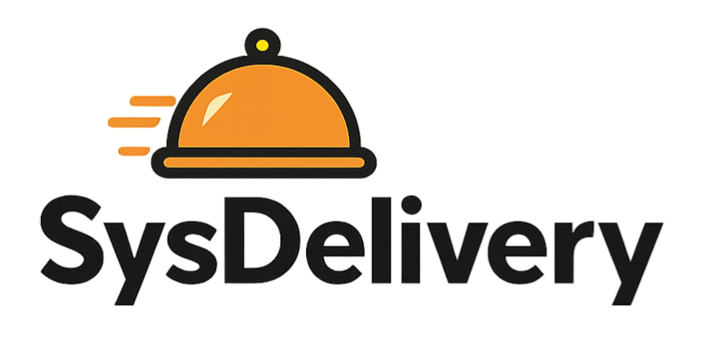

# 🛵 SysDelivery



Sistema de gerenciamento de entregas (Delivery) desenvolvido para fins acadêmicos no curso de Sistemas de Informação do IF Goiano.

Este projeto simula o fluxo de trabalho de uma aplicação de delivery com cadastro de produtos, usuários, pedidos e entregas, utilizando a arquitetura MVC e rodando 100% em containers Docker.

---

## 🎯 Objetivo Acadêmico

- Aplicar arquitetura MVC com CodeIgniter 4
- Gerenciar banco de dados MySQL com phpMyAdmin
- Criar ambiente LAMP utilizando Docker
- Desenvolver um sistema funcional para simulação de entregas

---

## 🧰 Tecnologias Utilizadas

- **PHP 8.2**
- **Apache 2.4**
- **MySQL 8.0**
- **phpMyAdmin**
- **CodeIgniter 4**
- **Docker / Docker Compose**

---

## 📦 Pré-requisitos

Antes de iniciar, instale em sua máquina:

- [Docker Desktop](https://www.docker.com/products/docker-desktop)
- [Git](https://git-scm.com/)

---

## 🚀 Como rodar o projeto

```bash
# Clone este repositório
git clone https://github.com/seu-usuario/sysdelivery.git
cd sysdelivery

# Copie o arquivo de variáveis de ambiente
cp .env.example .env

# Suba os containers
docker-compose up -d
